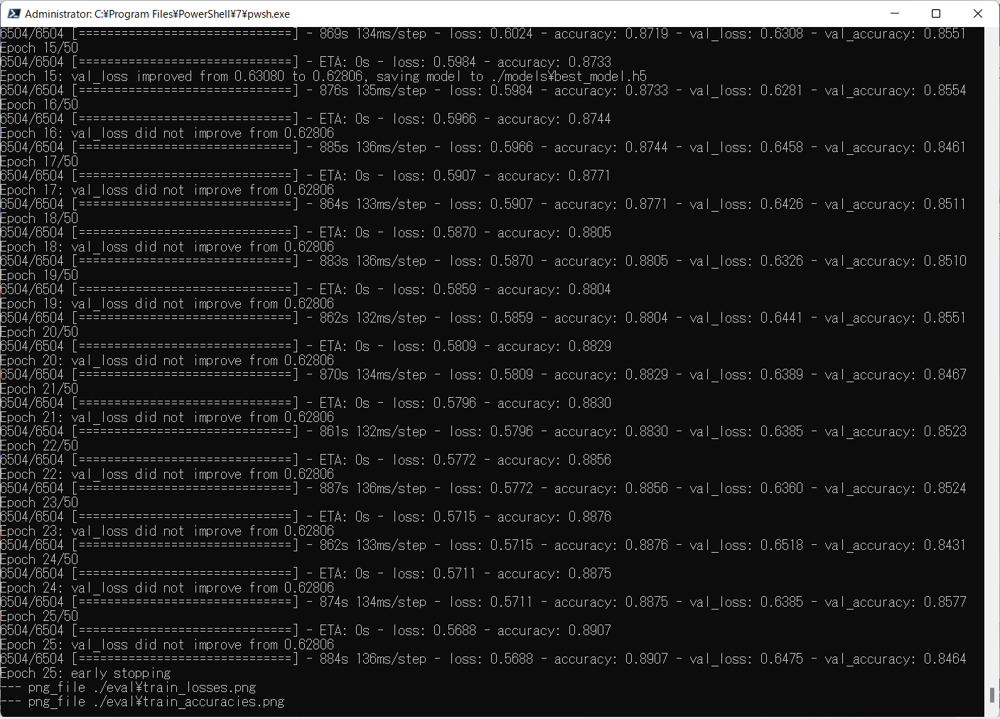
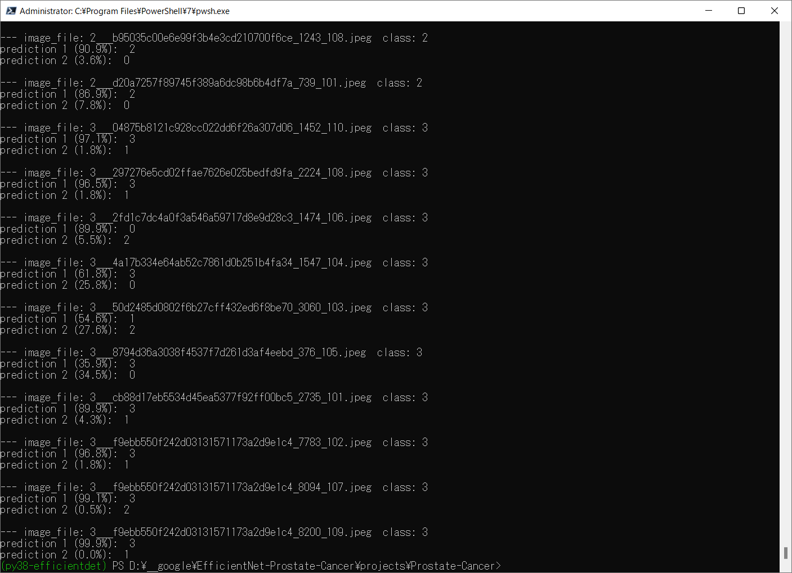
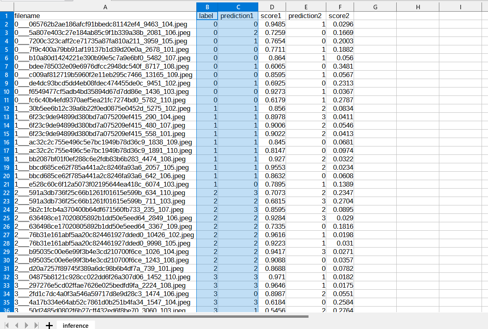
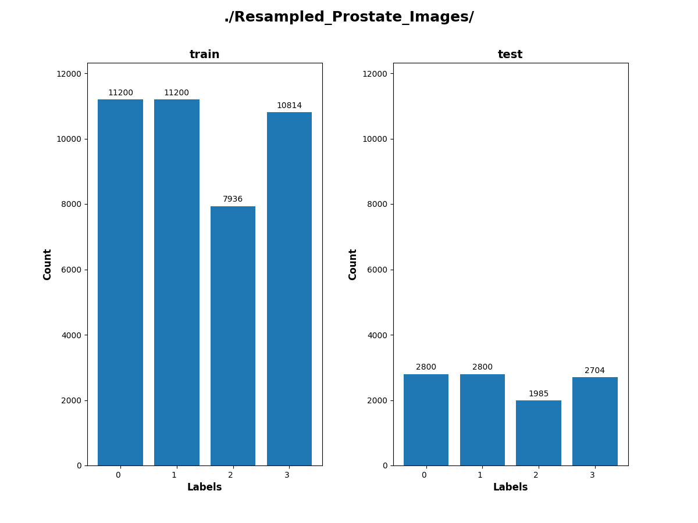
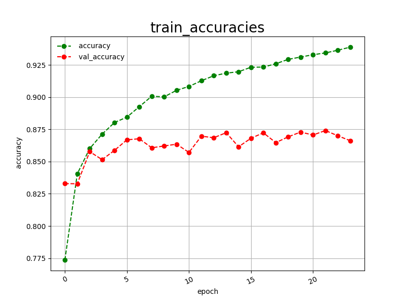
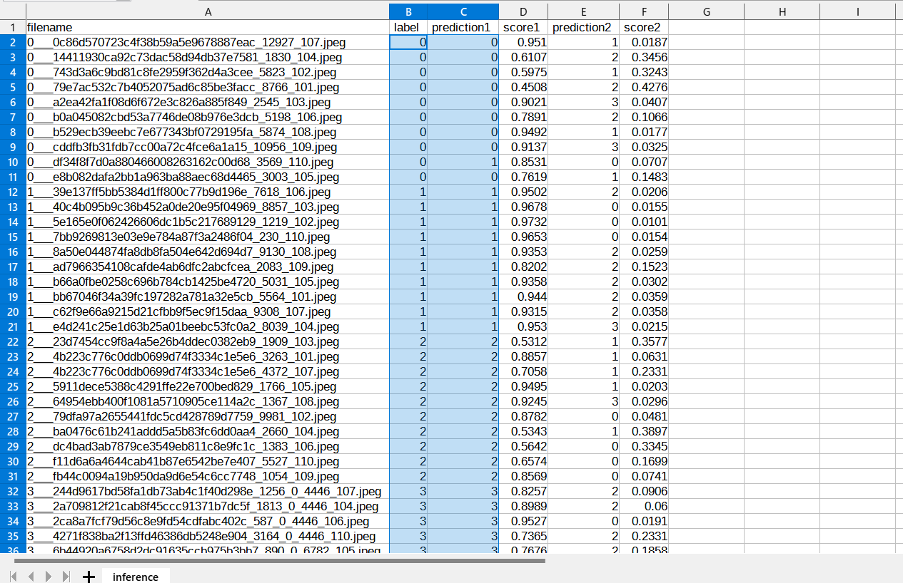
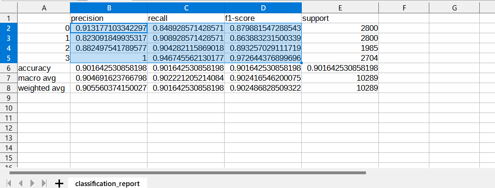
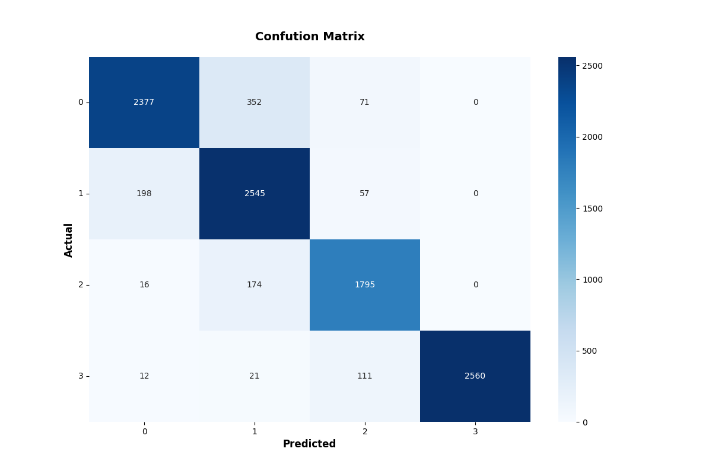

<h2>EfficientNet-Prostate-Cancer (Updated: 2022/10/26)</h2>
<a href="#1">1 EfficientNetV2 Prostate Cancer Classification </a> 
<a href="#1.1">1.1 Clone repository</a> 
<a href="#1.2">1.2 Prepare Prostate-Cancer dataset</a> 
<a href="#1.3">1.3 Install Python packages</a> 
<a href="#2">2 Python classes for Prostate-Cancer Classification</a> 
<a href="#3">3 Pretrained model</a> 
<a href="#4">4 Train</a> 
<a href="#4.1">4.1 Train script</a> 
<a href="#4.2">4.2 Training result</a> 
<a href="#5">5 Inference</a> 
<a href="#5.1">5.1 Inference script</a> 
<a href="#5.2">5.2 Sample test images</a> 
<a href="#5.3">5.3 Inference result</a> 
<a href="#6">6 Evaluation</a> 
<a href="#6.1">6.1 Evaluation script</a> 
<a href="#6.2">6.2 Evaluation result</a> 
<a href="#7">7 Improve Classification Accuracy</a> 
<a href="#7.1">7.1 Resampled_Prostate_Images</a> 
<a href="#7.2">7.2 Train</a> 
<a href="#7.3">7.3 Inference</a> 
<a href="#7.4">7.4 Evaluation</a> 

<h2>
<a id="1">1 EfficientNetV2 Prostate Cancer Classification</a>
</h2>

 This is an experimental EfficientNetV2 Prostate Cancer Classification project based on <b>efficientnetv2</b> in <a href="https://github.com/google/automl">Brain AutoML</a>.
 

This image dataset used here has been taken from the following website: 
https://github.com/MicheleDamian/prostate-gleason-dataset  

<a href="https://github.com/MicheleDamian/prostate-gleason-dataset/blob/master/LICENSE.md">DATASET LICENCE</a> 
About Prostate Gleason Dataset: Excerpt from the website above: 

Prostate Gleason Dataset is an image database of prostate cancer biopsies derived from the PANDA dataset. The database consists of about 70K patches of size 256x256 pixels extracted from the PANDA's biopsies with overlap. The patches are grouped in 4 classes depending on their Gleason grade:

Class 0: Stroma and Gleason 0 
Class 1: Gleason 3 
Class 2: Gleason 4 
Class 3: Gleason 5 
 
 We use python 3.8 and tensorflow 2.8.0 environment on Windows 11. 
 

<h3>
<a id="1.1">1.1 Clone repository</a>
</h3>
 Please run the following command in your working directory: 
<pre>
git clone https://github.com/atlan-antillia/EfficientNet-Prostate-Cancer.git
</pre>
You will have the following directory tree: 
<pre>
.
├─asset
└─projects
    └─Prostate-Cancer
        ├─eval
        ├─evaluation
        ├─inference
        ├─models
        ├─Prostate_Images
        └─test
</pre>
<h3>
<a id="1.2">1.2 Prepare Prostate_Cancer dataset</a>
</h3>

The image dataset used here has been taken from the following website: 
<a href="https://github.com/MicheleDamian/prostate-gleason-dataset">MicheleDamian/prostate-gleason-dataset</a>
 
<pre>
Prostate_Images
├─test
│  ├─0
│  ├─1
│  ├─2
│  └─3
└─train
    ├─0
    ├─1
    ├─2
    └─3    
</pre>

</pre>
The number of images in the dataset is the following: 
 
 

Prostate_Images/train/Cyst: 

 
 
Prostate_Images/train/Normal: 

 
 
Prostate_Images/train/Stone: 

 
 
Prostate_Images/train/Tumor: 

 

<h3>
<a id="#1.3">1.3 Install Python packages</a>
</h3>
Please run the following commnad to install Python packages for this project. 
<pre>
pip install -r requirements.txt
</pre>
 

<h2>
<a id="2">2 Python classes for Prostate-Cancer Classification</a>
</h2>
We have defined the following python classes to implement our Prostate-Cancer Classification. 
<li>
<a href="./ClassificationReportWriter.py">ClassificationReportWriter</a>
</li>
<li>
<a href="./ConfusionMatrix.py">ConfusionMatrix</a>
</li>
<li>
<a href="./CustomDataset.py">CustomDataset</a>
</li>
<li>
<a href="./EpochChangeCallback.py">EpochChangeCallback</a>
</li>
<li>
<a href="./EfficientNetV2Evaluator.py">EfficientNetV2Evaluator</a>
</li>
<li>
<a href="./EfficientNetV2Inferencer.py">EfficientNetV2Inferencer</a>
</li>
<li>
<a href="./EfficientNetV2ModelTrainer.py">EfficientNetV2ModelTrainer</a>
</li>
<li>
<a href="./FineTuningModel.py">FineTuningModel</a>
</li>

<li>
<a href="./TestDataset.py">TestDataset</a>
</li>

<h2>
<a id="3">3 Pretrained model</a>
</h2>
 We have used pretrained <b>efficientnetv2-b0</b> model to train Prostate-Cancer Classification FineTuning Model.
Please download the pretrained checkpoint file from <a href="https://storage.googleapis.com/cloud-tpu-checkpoints/efficientnet/v2/efficientnetv2-b0.tgz">efficientnetv2-b0.tgz</a>, expand it, and place the model under our top repository.

<pre>
.
├─asset
├─efficientnetv2-b0
└─projects
    └─Prostate-Cancer
  ...
</pre>

<h2>
<a id="4">4 Train</a>

</h2>
<h3>
<a id="4.1">4.1 Train script</a>
</h3>
Please run the following bat file to train our Prostate-Cancer Classification efficientnetv2 model by using
<a href="./projects/Prostate-Cancer/Prostate_Cancer_Images/train">Resampled_Kidney_Simpler_Disease_Images/train</a>.
<pre>
./1_train.bat
</pre>
<pre>
rem 1_train.bat
python ../../EfficientNetV2ModelTrainer.py ^
  --model_dir=./models ^
  --eval_dir=./eval ^
  --model_name=efficientnetv2-b0  ^
  --data_generator_config=./data_generator.config ^
  --ckpt_dir=../../efficientnetv2-b0/model ^
  --optimizer=rmsprop ^
  --image_size=224 ^
  --eval_image_size=224 ^
  --data_dir=./Prostate_Images/train ^
  --data_augmentation=True ^
  --valid_data_augmentation=True ^
  --fine_tuning=True ^
  --monitor=val_loss ^
  --learning_rate=0.0001 ^
  --trainable_layers_ratio=0.4 ^
  --dropout_rate=0.2 ^
  --num_epochs=50 ^
  --batch_size=8 ^
  --patience=10 ^
  --debug=True  
</pre>
, where data_generator.config is the following: 
<pre>
; data_generation.config

[training]
validation_split   = 0.2
featurewise_center = Fale
samplewise_center  = False
featurewise_std_normalization=True
samplewise_std_normalization =False
zca_whitening                =False
rotation_range     = 20
horizontal_flip    = True
vertical_flip      = True
width_shift_range  = 0.1
height_shift_range = 0.1
shear_range        = 0.01
zoom_range         = [0.2, 2.0]
data_format        = "channels_last"

[validation]
validation_split   = 0.2
featurewise_center = False
samplewise_center  = False
featurewise_std_normalization=True
samplewise_std_normalization =False
zca_whitening                =False
rotation_range     = 20
horizontal_flip    = True
vertical_flip      = True
width_shift_range  = 0.1
height_shift_range = 0.1
shear_range        = 0.01
zoom_range         = [0.2, 2.0]
data_format        = "channels_last"

</pre>

<h3>
<a id="4.2">4.2 Training result</a>
</h3>

This will generate a <b>best_model.h5</b> in the models folder specified by --model_dir parameter. 
Furthermore, it will generate a <a href="./projects/Prostate-Cancer/eval/train_accuracies.csv">train_accuracies</a>
and <a href="./projects/Prostate-Cancer/eval/train_losses.csv">train_losses</a> files
 
Training console output: 
 
 
Train_accuracies: 
 

 
Train_losses: 
 

 
<h2>
<a id="5">5 Inference</a>
</h2>
<h3>
<a id="5.1">5.1 Inference script</a>
</h3>
Please run the following bat file to infer the breast cancer in test images by the model generated by the above train command. 
<pre>
./2_inference.bat
</pre>
<pre>
rem 2_inference.bat: modified eval_image_size to be 224
python ../../EfficientNetV2Inferencer.py ^
  --model_name=efficientnetv2-b0  ^
  --model_dir=./models ^
  --fine_tuning=True ^
  --trainable_layers_ratio=0.4 ^
  --dropout_rate=0.2 ^
  --image_path=./test/*.jpeg ^
  --eval_image_size=224 ^
  --label_map=./label_map.txt ^
  --mixed_precision=True ^
  --infer_dir=./inference ^
  --debug=False 
</pre>
 
label_map.txt:
<pre>
0
1
2
3
</pre>
 
<h3>
<a id="5.2">5.2 Sample test images</a>
</h3>

Sample test images generated by <a href="./projects/Prostate-Cancer/create_test_dataset.py">create_test_dataset.py</a> 
from <a href="./projects/Prostate-Cancer/Prostate_Images/test">Prostate_Imagess/test</a>.
 
 

<h3>
<a id="5.3">5.3 Inference result</a>
</h3>
This inference command will generate <a href="./projects/Prostate-Cancer/inference/inference.csv">inference result file</a>.
 
 
Inference console output: 
 
 

Inference result (inference.csv): 
 
 
<h2>
<a id="6">6 Evaluation</a>
</h2>
<h3>
<a id="6.1">6.1 Evaluation script</a>
</h3>
Please run the following bat file to evaluate <a href="./projects/Prostate-Cancer/Prostate_Images/test">
Prostate_Images/test</a> by the trained model. 
<pre>
./3_evaluate.bat
</pre>
<pre>
rem 3_evaluate.bat
python ../../EfficientNetV2Evaluator.py ^
  --model_name=efficientnetv2-b0  ^
  --model_dir=./models ^
  --data_dir=./Prostate_Images/test ^
  --evaluation_dir=./evaluation ^
  --fine_tuning=True ^
  --trainable_layers_ratio=0.4 ^
  --dropout_rate=0.2 ^
  --eval_image_size=224 ^
  --mixed_precision=True ^
  --debug=False 
</pre>
 

<h3>
<a id="6.2">6.2 Evaluation result</a>
</h3>

This evaluation command will generate <a href="./projects/Prostate-Cancer/evaluation/classification_report.csv">a classification report</a>
 and <a href="./projects/Prostate-Cancer/evaluation/confusion_matrix.png">a confusion_matrix</a>.
 
 
Evaluation console output: 
 
 

 
Classification report: 
 

 
Confusion matrix: 
 

<h2>
<a id="7">7 Improve Classificaiton Accuracy</a>
</h2>
<h3>
<a id="7.1">7.1 Resampled_Prostate_Images</a>
</h3>
We will try to improve classification accuray by training our Prostate-Cancer FineTuninig Model with
a better dataset. 
In order to get a better balanced dataset than the original Prostate_Images, we have created <b>Resampled_Prostate_Images</b>
from the dataset <b>Prostate_Images/train</b>
by using a resampling tool <a href="https://github.com/martian-antillia/ImageDatasetResampler">ImageDatasetResampler</a>. 
 
The distribution of images of the Resampled_Prostate_Images is the following: 
 
You can down load the resampled dataset from the following link on google-drive. 
<a href="https://drive.google.com/file/d/1n3tzWXT8yyKjx6V_e5ZZ_geDPZvr99wA/view?usp=sharing">Resampled_Prostate_Images.zip (1.41GB)</a> 
Please expand the downloaded zip file and put it under <b>,/projects/Resampled_Prostate-Cancer</b> folder. 
 
Resampled_Prostate_Cancer
<pre>
├─asset
├─efficientnetv2-b0
└─projects
    ├─Prostate-Cancer
    │  ├─eval
    │  ├─evaluation
    │  ├─inference
    │  ├─models
    │  └─test
    └─Resampled_Prostate-Cancer
        ├─asset
        ├─eval
        ├─evaluation
        ├─inference
        ├─models
        ├─Resampled_Prostate_Images
        │  ├─test
        │  │  ├─0
        │  │  ├─1
        │  │  ├─2
        │  │  └─3
        │  └─train
        │      ├─0
        │      ├─1
        │      ├─2
        │      └─3
        └─test
</pre>
 
Please be careful that the LICENCE of the new resampled dataset is the same as the <a href="https://github.com/MicheleDamian/prostate-gleason-dataset/blob/master/LICENSE.md">orginal dataset LICENSE</a>. 
<b>
Creative Commons Attribution-NonCommercial-ShareAlike 4.0 International
</b>
 
<h3>  
<a id="7.2">7.2 Train</a>
</h3>
Please run <b>1_train.bat</b> under Resampled_Prostate_Images folder, then you get the following results. 
<a href="./projects/Resampled_Prostate-Cancer/eval/train_accuracies.csv">Train accuracies</a>: 
 
<a href="./projects/Resampled_Prostate-Cancer/eval/train_losses.csv">Train losses: 
 

<h3>  
<a id="7.3">7.3 Inference</a>
</h3>
Pleaes run <b>2_inference.bat</b> under Resampled_Prostate_Images folder, then you get the following results. 

<a href="./projects/Resampled_Prostate-Cancer/inference/inference.csv">Inference</a> 
 

 
<h3>  
<a id="7.4">7.4 Evaluation</a>
</h3>
Please run <b>2_evaluate.bat</b> under Resampled_Prostate_Images folder, then you get the following results. 
In this case, the classification precision, recall and f1-score are slightly improved than that of the original non-resampled dataset. 
<a href ="./projects/Resampled_Prostate-Cancer/evaluation/classification_report.csv">Classification Report:</a> 
 
 
Confusion Matrix: 
 
 

<h3>
References
</h3>
<b>1. Prostate Gleason Dataset</b> 
<pre>
https://github.com/MicheleDamian/prostate-gleason-dataset  
</pre>

<b>2. Prostate Cancer Detection using Deep Convolutional Neural Networks</b> 
Sunghwan Yoo, Isha Gujrathi, Masoom A. Haider & Farzad Khalvati 
<pre>
https://www.nature.com/articles/s41598-019-55972-4
</pre>

<b>3. Evolution-based Fine-tuning of CNNs for Prostate Cancer Detection</b> 
Khashayar Namdar, Isha Gujrathi, Masoom A. Haider, Farzad Khalvati 
<pre>
https://arxiv.org/pdf/1911.01477.pdf
</pre>

<b>4. A Review on Prostate Cancer Detection using CNN</b> 
Merlyn Koonamparampath1, Raj Shah, Mahipal Sundvesha, Meena Ugale 
<pre>
https://www.academia.edu/74053872/A_Review_on_Prostate_Cancer_Detection_using_CNN?email_work_card=view-paper
</pre>
